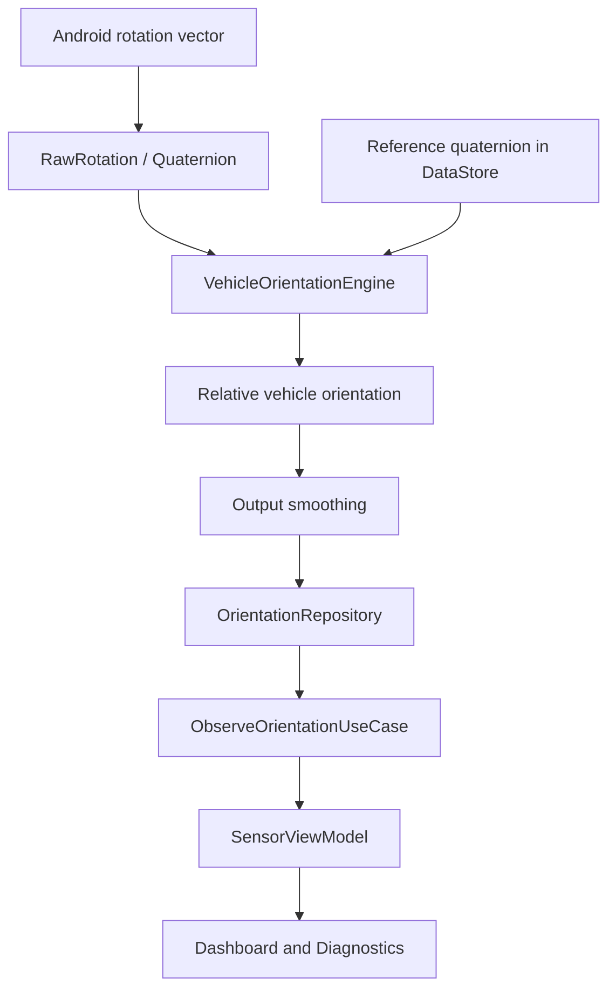

# GR Offroad Meter

GR Offroad Meter is an Android inclinometer designed for phones mounted in 4x4 vehicles. It displays real-time roll and pitch readings through a dark interface functionally inspired by classic off-road instrumentation.

The application reads Android rotation-vector sensors directly and calibrates the phone position using a reference rotation. The UI does not calculate orientation or handle quaternions; it only renders values prepared by the domain pipeline.

## Features

- Combined roll and pitch inclinometer built with Jetpack Compose `Canvas`.
- Responsive Dashboard designed primarily for landscape use.
- Digital values with an explicit sign and one decimal place.
- Visual scale from `-45°` to `+45°`; digital readouts preserve the real value outside that range.
- Graphical zones for normal, caution, and high inclination ranges.
- Zero calibration using a reference quaternion persisted with DataStore.
- Three output-filter response presets: Responsive, Balanced, and Stable.
- Compact G-force meter.
- Sensor Diagnostics screen showing the active sensor, approximate sampling rate, quaternions, and raw, calibrated, and filtered orientations.
- Manual screen-orientation toggle.
- Existing `car` module for Android Auto. The current mobile Dashboard is developed independently.

## Orientation Pipeline

The preferred sensor is `TYPE_GAME_ROTATION_VECTOR`. When it is unavailable, the application falls back to `TYPE_ROTATION_VECTOR`.



The mathematical sequence is:

```text
Rotation Vector
  → Quaternion
  → Reference calibration
  → Relative quaternion
  → Vehicle coordinate transformation
  → Pitch / Roll
  → Output filter
```

The pipeline does not use Euler offsets, and Compose does not add a second filtering layer. The instrument animation is only a short visual transition.

## User Interface

In landscape, the inclinometer occupies most of the available space and simultaneously displays:

- roll arc and angular scale;
- front-facing vehicle reference;
- pitch horizon and vertical scale;
- digital roll and pitch values;
- calibration status;
- direct access to `ZERO`;
- compact secondary G-force panel.

Portrait mode retains the same instrument and places secondary information below it. The `Dashboard landscape`, `Dashboard portrait`, and `Off-road inclinometer` previews are available in Android Studio.

## Calibration and Diagnostics

1. Install the phone in its final mounting position inside the vehicle.
2. Place the vehicle in the position you want to use as the level reference.
3. Press `ZERO` on the Dashboard or `CALIBRATE ZERO` in Settings.
4. Confirm that `CALIBRATED` appears and that roll and pitch are close to `0°`.
5. Open `SENSOR DIAGNOSTICS` to compare raw, calibrated, and filtered orientations.
6. Select `RESET CALIBRATION` to remove the stored reference.

## Architecture

The project follows MVVM with use cases and separates domain, data, platform, and presentation responsibilities.

```text
app/
├── platform/rotation
└── presentation
    ├── model
    ├── ui
    │   └── component
    └── viewmodel

common/
├── domain
│   ├── calculator
│   ├── engine
│   ├── filter
│   ├── model
│   ├── repository
│   └── usecase
├── data
│   ├── filter
│   ├── model
│   ├── repository
│   └── source
└── platform
    ├── preferences
    └── sensors
```

### Gradle Modules

- `:app`: mobile application, navigation, ViewModel, and Compose UI.
- `:common`: models, use cases, mathematical engine, repositories, DataStore, and Android sensor adapters.
- `:car`: existing Android Auto integration.

## Technology Stack

- Kotlin 2.2.10
- Jetpack Compose and Material 3
- Hilt
- Kotlin Coroutines and Flow
- Preferences DataStore
- Gradle 9.6 with Kotlin DSL
- Android Gradle Plugin 9.4.1
- Gradle Version Catalog

## Requirements

- Android Studio with a Gradle JDK compatible with Gradle 9.6.
- Android SDK 36.
- A device or emulator running Android 12 / API 31 or newer.
- A `GAME_ROTATION_VECTOR` or `ROTATION_VECTOR` sensor.

The source is compiled with Java 17 compatibility. The JBR bundled with a recent Android Studio release can be used as the Gradle JDK.

## Build and Test

From the project root, run:

```bash
./gradlew testDebugUnitTest assembleDebug
```

The debug APK is generated at:

```text
app/build/outputs/apk/debug/app-debug.apk
```

To install it on a connected device, run:

```bash
./gradlew installDebug
```

Unit tests cover quaternion operations, relative orientation, calibration with non-trivial references, and G-force calculations.

## Testing on a Vehicle or Phone Mount

- Mount the phone in landscape and calibrate the reference position.
- Tilt the device to both sides and verify that the vehicle reference, arc, and `ROLL` value move in the same direction.
- Tilt the top of the phone forward and backward to verify the `UP/DOWN` scale and `PITCH` value.
- With the phone in your hand, temporarily exceed `45°` to confirm that the visual indicator stops at the scale limit while the digital readout continues to show the real value.
- Open Sensor Diagnostics to verify the selected sensor type and sampling rate.
